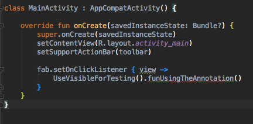

## How does visible for testing works?

**It doesn't** thanks for reading, xD

Seriously, it does nothing but **linting**

 1. Look at the annotation class, the default privacy is Private, that will give a highlight linting
 2. You can change that with `@VisibleForTesting(otherwise = VisibleForTesting.NONE)` that will give you red underline linting

**The code still can be used run the app, it won't crash**